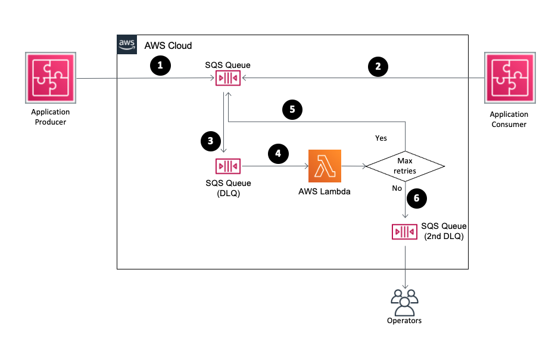

# SQS dead letter queue replay with backoff and jitter

The theory behind the implementation is described in this article: [Exponential backoff and jitter](https://aws.amazon.com/blogs/architecture/exponential-backoff-and-jitter/)

This serverless application deploys an AWS lambda function that replays each message of the specified DLQ with an exponential backoff and jitter. After some unseccessful retries the function throws an error which can move the message to a secondary DLQ.

## App Architecture

## Installation Instructions

**Deploying the application with the Serverless Application Repository**

1. [Create an AWS account](https://portal.aws.amazon.com/gp/aws/developer/registration/index.html) if you do not already have one
1. Go to the app's page on the sqs-dlq-replay-backoff Serverless Application Repository page and click "Deploy"
1. Provide the required application parameters and click "Deploy"

**Deploying the application leveraging SAM (AWS Serverless Application Model):**

1. [Create an AWS account](https://portal.aws.amazon.com/gp/aws/developer/registration/index.html) if you do not already have one
1. Make sure to have [sam cli](https://docs.aws.amazon.com/serverless-application-model/latest/developerguide/serverless-sam-cli-install.html) installed.
1. Go to the directory you just cloned
1. Do a `sam build --use-container` (you need to have docker started)
1. Do a `sam --deploy guided` (it will help you go through the different steps and also parameters available in the stack to configure the jitter and backoff)

## Deployment Outputs

1. `ReplayFunctionArn` - My ARN for the Lambda function if needed to be used externally.

## Security

See [CONTRIBUTING](CONTRIBUTING.md#security-issue-notifications) for more information.

## License

This library is licensed under the MIT-0 License. See the LICENSE file.
